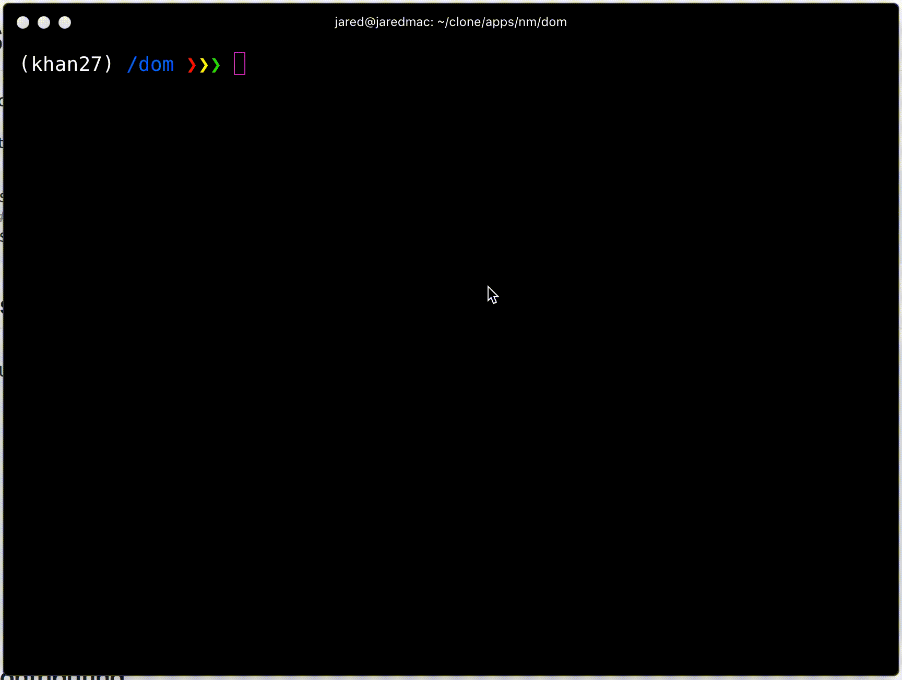

# Style Cleanup

Wouldn't it be nice if you could automatically find & remove unused React
Native and Aphrodite style declarations?

`stylecleanup` is here to help!

```bash
$ yarn global add stylecleanup
# or
$ npm install -g stylecleanup
```



## Usage

```
Usage: stylecleanup [command] some/file/to/check.js
  command: one of 'check', 'fix', 'fix-force'
  globs are also supported, e.g.

  stylecleanup check './src/**/*.js'

  check: find & report missing & unused styles
  fix: remove all unused styles, but skip styles that *might* be used, but
    can't be verified because e.g. the stylesheet variable is passed around,
    or there's a computed property access. If you do 'styles[something]' it
    might be accessing anything, so we can't know for sure that apparently
    unused styles are actually unused.
  fix-force: remove all unnused styles, and all 'potentially' unused styles
```

## Contributing

Does this sound interesting to you? Do you want it to do something it doesn't?
Please jump in! I don't have a ton of opinions about this project, so if
there's a change you think should happen, I'm probably down for it. Just file
an issue or make a pull request!
